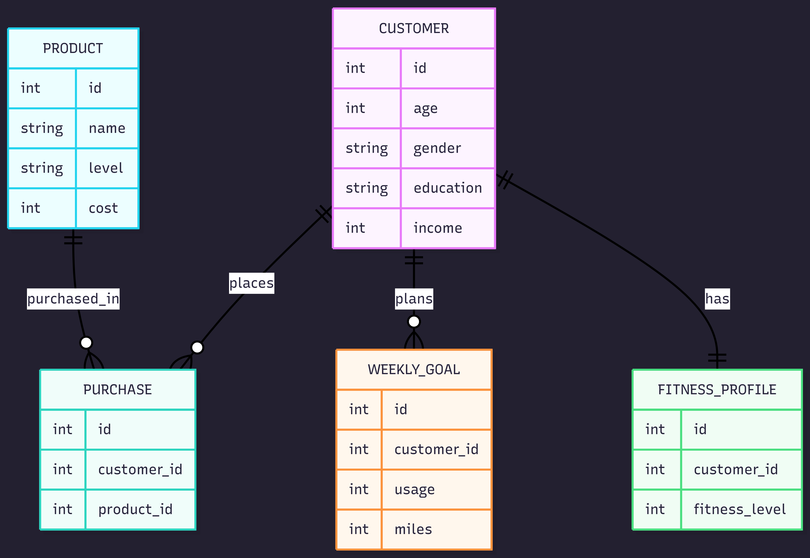

# Design Document

By Tejaswini Samanta

Video overview: (Normally there would be a URL here, but not for this sample assignment!)

## Scope

The database for CS50 SQL includes all entities necessary to facilitate the process of tracking individuals who purchased a treadmill from the AeroFit stores, their fitness profiles and weekly goals. As such, included in the database's scope is:

* Customers, including basic identifying information such as age, gender, education in years, marital status and annual income
* Weekly_goal, including customers' average number of miles the customer expects to walk/run and plans to use the treadmill each week
* Fitness_Profile, including the self-rated fitness on a 1-5 scale, where 1 is the poor shape and 5 is the excellent shape
* Product, which includes name of the product, difficulty level and cost
* Purchase information of each customer

Out of scope are elements like names of the customer, use timings, and other non-core attributes.

## Functional Requirements

This database will support:

* CRUD operations for customers and products
* Tracking customer purchases across different treadmill products
* Analyzing customer fitness profiles and planned weekly usage
* Supporting analytical queries for customer segmentation and revenue analysis

## Representation

Entities are captured in SQLite tables with the following schema.

### Entities

The database includes the following entities:

#### Customers

The `customer` table includes:

* `id`, which specifies the unique ID for the customer as an `INTEGER`. This column thus has the `PRIMARY KEY` constraint applied. A `AUTOINCREMENT` constraint ensures no two customer information uploaded have the same id.
* `age`, which specifies the customer's age in years as `INTEGER`, given `INTEGER` is appropriate for age fields.
* `gender`, which specifies the customer's gender as male/female as `TEXT`, given `TEXT` is appropriate for gender fields.
* `education`, which specifies the customer's education in years. `INTEGER` is used for the same reason as `age`.
* `marital_status`, which specifies whether the customer is single or partnered as `TEXT`. `TEXT` is used for the same reason as `gender`.
* `income`, which specifies the customer's annual income in US dollars as `INTEGER`. `INTEGER` is used for the same reason as `age`.

All columns in the `customer` table are required, and hence should have the `NOT NULL` constraint applied. No other constraints are necessary.

#### Weekly_Goal

The `weekly_goal` table includes:

* `id`, which specifies the unique ID for every customer's weekly goal as `INTEGER`. This column thus has the `PRIMARY KEY` constraint applied. A `AUTOINCREMENT` constraint ensures no two customer information uploaded have the same id.
* `customer_id`, which is the ID of the customer who stated their weekly goal as an `INTEGER`. This column thus has the `FOREIGN KEY` constraint applied, referencing the `id` column in the `customer` table to ensure data integrity.
* `usage`, which specifies the average number of times the customer plans to use the treadmill each week as an `INTEGER`.
* `miles`, which specifies the average number of miles the customer expects to walk/run each week as an `INTEGER`.

All columns in the `weekly_goal` table are required, and hence should have the `NOT NULL` constraint applied. No other constraints are necessary.

#### Fitness_Profile

The `fitness_profile` table includes:

* `id`, which specifies the unique ID for the customer's fitness profile as an `INTEGER`. This column thus has the `PRIMARY KEY` constraint applied. A `AUTOINCREMENT` constraint ensures no two customer information uploaded have the same id.
* `customer_id`, which is the ID of the customer whose fitness profile is recorded as an `INTEGER`. This column thus has the `FOREIGN KEY` constraint applied, referencing the `id` column in the `customer` table to ensure data integrity.
* `fitness_level`, which is the self-rated fitness on a 1-5 scale, where 1 is the poor shape and 5 is the excellent shape as `INTEGER`.

All columns in the `fitness_profile` table are required, and hence should have the `NOT NULL` constraint applied. No other constraints are necessary.

#### Product

* `id`, which specifies the unique ID for the product as an `INTEGER`. This column thus has the `PRIMARY KEY` constraint applied.
* `name`, which is the name of the treadmill product as `TEXT`.
* `level`, which specifies the difficulty level of treadmill as entry-level, mid-level or advanced as `TEXT`.
* `cost`, which specifies the product's cost as `INTEGER`, given `INTEGER` is appropriate for cost fields.

All columns in the `product` table are required, and hence should have the `NOT NULL` constraint applied. No other constraints are necessary.

#### Purchase

The `purchase` table includes:

* `id`, which specifies the unique ID for the purchase as an `INTEGER`. This column thus has the `PRIMARY KEY` constraint applied. A `AUTOINCREMENT` constraint ensures no two customer information uploaded have the same id.
* `customer_id`, which is the ID of the customer who made the purchase as an `INTEGER`. This column thus has the `FOREIGN KEY` constraint applied, referencing the `id` column in the `customer` table to ensure data integrity.
* `product_id`, which is the ID of the product which the customer purchases as an `INTEGER`. This column thus has the `FOREIGN KEY` constraint applied, referencing the `id` column in the `product` table to ensure data integrity.

All columns are required and hence have the `NOT NULL` constraint applied where a `PRIMARY KEY` or `FOREIGN KEY` constraint is not.

### Relationships

The below entity relationship diagram describes the relationships among the entities in the database.

As detailed by the diagram:

* A customer is capable of making 0 to many purchases: 0 if the customer has not purchased any treadmill, and many if the customer has purchased more than one product. Each purchase is made by one and only one customer. It is assumed that all purchases are individual and not shared across customers.
* A purchase is associated with one and only one product. At the same time, a product can be associated with 0 to many purchases: 0 if no customers have purchased that product, and many if multiple customers have purchased the same treadmill model.
* A customer can plan 0 to many weekly goals: 0 if the customer has not specified any planned usage, and many if the customer updates or records multiple weekly goals over time. Each weekly goal belongs to one and only one customer.
* A fitness profile is associated with one and only one customer, representing the customer’s self-reported fitness level. At the same time, each customer has exactly one fitness profile, and fitness profiles are not shared between customers.

## Optimizations

Per the typical queries in `queries.sql`, it is common for users of the database to access information associated with a particular customer, such as their planned weekly usage, fitness profile, and purchase history. For that reason, indexes are created on the `customer_id` column in the `weekly_goal` and `fitness_profile` tables to speed up joins and filtering by customer.

Similarly, it is common for analytical queries to retrieve purchase records for specific customers or products. As such, foreign key columns in the `purchase` table are indexed to improve the performance of joins between customers, products, and purchases.

In addition, a view named `revenue` is created to simplify queries related to the monetary value of customer purchases. The view derives revenue information by joining the `purchase` and `product` tables and exposes product cost data associated with each customer. By encapsulating this logic in a view, the database avoids repeated join operations in analytical queries while preserving normalization and data integrity.

## Limitations

The current schema assumes individual purchases. Supporting scenarios such as family or corporate purchases would require introducing a many-to-many relationship between customers and purchases. The database represents a static snapshot of customer behavior and does not track changes to customer attributes, fitness levels, or weekly goals over time.
